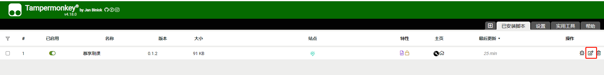
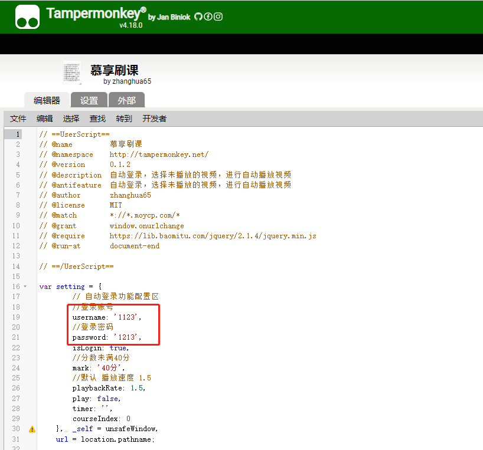

## 📜 脚本功能（推荐使用Chrome浏览器）

- 慕享自动刷课脚本
- 自动登录 需要修改添加账号密码

## ⚠ 脚本声明

1. 该项目仅用于学习交流，且不可用于商业行为，否则后果自负

## ☆更新介绍

-   V0.1.0：正式版本发布
-   v0.1.1: 自动登录功能
-   v0.1.2: 跳转下集的一些问题优化
-   v0.1.3: 优化播放无法跳转下一个课程
-   v0.1.4  优化播放，增加手动填写账户密码
